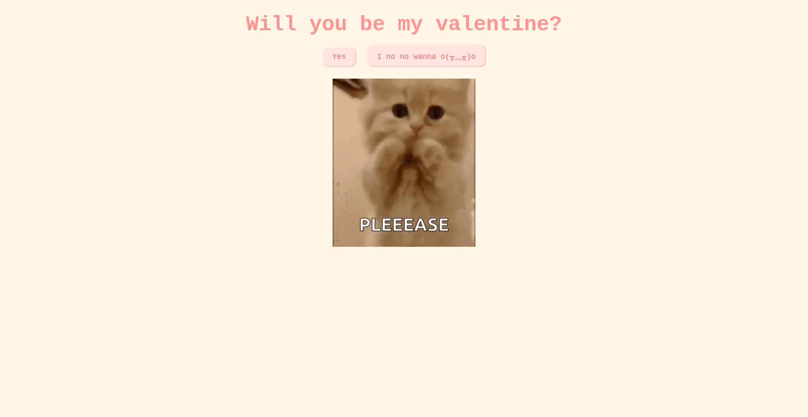

# 💘 A do të jesh Valentina ime? 🇦🇱

Created by **Erion Nezha**.

> Një mënyrë interaktive dhe lozonjare për t'i bërë atij personi të veçantë pyetjen e madhe — me një surprizë për këdo që përpiqet të klikojë "Jo".

**🔴 Demo live:** https://erionnezha.github.io/Valentine/

## 💡 Si funksionon

1. Hap faqen — të pyetet **"A do të jesh Valentina ime?"**
2. Kliko **Po** → zgjidh një datë 📅, zgjidh ushqimin 🍔, zgjidh ëmbëlsirën 🍰, zgjidh një aktivitet 🎡
3. Provo të klikosh **Jo**… fat të mbarë me këtë 😏
4. Përfundo në faqen e falënderimit me muzikë dhe festë 🎉

Faqet: `index.html` → `date.html` → `food.html` → `dessert.html` → `activities.html` → `lastpage.html` → `thankyou.html`

## ▶️ Ekzekuto lokalisht

Thjesht hap `index.html` në çdo shfletues — pa build, pa varësi.

## 🙏 Kredite

Krijuar nga **Erion Nezha**.

## 📄 Licenca

Copyright © 2026 Erion Nezha. Të gjitha të drejtat e rezervuara. Shih [LICENSE](LICENSE).

---

# 💘 Will You Be My Valentine? 🇬🇧

> An interactive, playful way to ask that special someone the big question — with a surprise for anyone who tries to click "No".

**🔴 Live demo:** https://erionnezha.github.io/Valentine/

## 💡 How it works

1. Open the page — you're asked **"Will you be my Valentine?"**
2. Click **Yes** → pick a date 📅, choose food 🍔, pick dessert 🍰, choose an activity 🎡
3. Try clicking **No**… good luck with that 😏
4. Finish on the thank-you page with music and celebration 🎉

Pages: `index.html` → `date.html` → `food.html` → `dessert.html` → `activities.html` → `lastpage.html` → `thankyou.html`

## ▶️ Run locally

Just open `index.html` in any browser — no build step, no dependencies.

## 🙏 Credits

Created by **Erion Nezha**.

## 📄 License

Copyright © 2026 Erion Nezha. All rights reserved. See [LICENSE](LICENSE).
